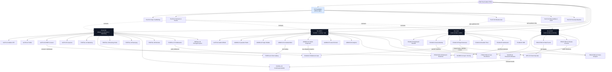

# Final Mermaid Map — Four-Service PRD Distribution

```mermaid
flowchart TB
  root(["BIO Final Golden PRDs"])
  root --> foundation["P0 Foundation\nall four repos"]
  root --> portal["bio-portal\nalways-on commerce + marketing"]
  root --> admin["bio-admin\ncuration + scoring + ops"]
  root --> exam["bio-exam\nexam-window runtime"]
  root --> proctor["bio-proctor\nexam-window proctoring"]

  foundation --> PLAT01["PLAT-01 Repo Scaffolding"]
  foundation --> PLAT02["PLAT-02 Contracts & Events"]
  foundation --> PLAT03["PLAT-03 Infrastructure"]
  foundation --> PLAT04["PLAT-04 Observability & Audit"]
  foundation --> PLAT05["PLAT-05 Security Baseline"]

  portal --> AUTH01["AUTH-01 Mobile OTP"]
  portal --> AUTH02["AUTH-02 Profile"]
  portal --> AUTH03["AUTH-03 DPDP Consent"]
  portal --> AUTH05["AUTH-05 Sessions"]
  portal --> PORTAL01["PORTAL-01 Marketing"]
  portal --> PORTAL02["PORTAL-02 Slot Catalog"]
  portal --> PORTAL03["PORTAL-03 Booking Holds"]
  portal --> PORTAL04["PORTAL-04 Razorpay"]
  portal --> PORTAL05["PORTAL-05 Confirmation/Admit"]
  portal --> PORTAL06["PORTAL-06 Refunds"]
  portal --> PORTAL07["PORTAL-07 Entitlements"]
  portal --> PORTAL08["PORTAL-08 Pricing/Coupons"]

  admin --> AUTH04["AUTH-04 Admin RBAC"]
  admin --> ADMIN01["ADMIN-01 Question Bank"]
  admin --> ADMIN02["ADMIN-02 Paper Builder"]
  admin --> ADMIN03["ADMIN-03 Schedule/Slots"]
  admin --> ADMIN04["ADMIN-04 Publish Snapshots"]
  admin --> ADMIN05["ADMIN-05 Users/Schools"]
  admin --> ADMIN06["ADMIN-06 Analytics"]
  admin --> SCORE01["SCORE-01 Async Scoring"]
  admin --> SCORE02["SCORE-02 Results/Certificates"]
  admin --> OPS01["OPS-01 Exam-Day Ops"]

  exam --> EXAM00["EXAM-00 Dashboard Handoff"]
  exam --> EXAM01["EXAM-01 Device/Identity"]
  exam --> EXAM02["EXAM-02 Entitlement Gate"]
  exam --> EXAM03["EXAM-03 Player/Autosave"]
  exam --> EXAM04["EXAM-04 Durable Timer"]
  exam --> EXAM05["EXAM-05 Submission"]
  exam --> EXAM06["EXAM-06 SEB"]

  proctor --> PROCTOR01["PROCTOR-01 Face Enrollment"]
  proctor --> PROCTOR02["PROCTOR-02 Frame Analysis"]
  proctor --> PROCTOR03["PROCTOR-03 Risk Events"]
  proctor --> PROCTOR04["PROCTOR-04 Review Console"]
  proctor --> PROCTOR05["PROCTOR-05 Biometric Retention"]

  ADMIN03 -- "slot catalog" --> PORTAL02
  ADMIN04 -- "key-stripped snapshot" --> EXAM02
  PORTAL07 -- "paid entitlement" --> EXAM02
  EXAM05 -- "submitted attempts" --> SCORE01
  SCORE02 -- "released results" --> PORTAL05
  EXAM01 -- "proctor readiness" --> PROCTOR01
  EXAM03 -- "frame hooks / attempt context" --> PROCTOR02
  PROCTOR03 -- "risk signals" --> OPS01
  PROCTOR04 -- "holds / decisions" --> SCORE02
  AUTH03 -- "consent / withdrawal" --> PROCTOR05
  PLAT02 -. "contracts" .-> portal
  PLAT02 -. "contracts" .-> admin
  PLAT02 -. "contracts" .-> exam
  PLAT02 -. "contracts" .-> proctor
  PLAT03 -. "spin-up/down infra" .-> exam
  PLAT03 -. "spin-up/down infra" .-> proctor

  classDef service fill:#111827,color:#fff,stroke:#334155,stroke-width:2px;
  classDef phase fill:#dbeafe,color:#0f172a,stroke:#2563eb,stroke-width:1px;
  classDef prd fill:#f8fafc,color:#0f172a,stroke:#94a3b8,stroke-width:1px;
  class portal,admin,exam,proctor service;
  class foundation phase;
```
