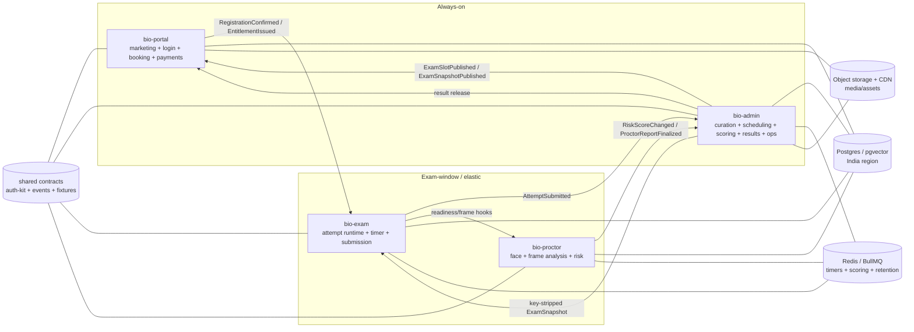

# BIO Final Golden PRDs

**Status:** final golden PRD set for implementation planning.  
**Date:** 2026-06-08  
**Scope:** final four-service golden PRD set for implementation planning. Historical draft/source packs were consolidated here and removed from the working tree; use git history for provenance audits.

## Golden-source rule

Use this directory for all future planning and implementation. This final set supersedes all historical draft/source PRD packs (`docs/prd/`, `docs/prds/`, `docs/all-prds-re-arch/`, and `docs/all-prds-re-arch-pass-2/`), which have been removed from the working tree to avoid duplicate or stale implementation sources. `bio-core` is retired as an implementation repo/service. Its responsibilities are split into `bio-admin` and `bio-exam`.

## Final project/service decision

Four deployable service projects:

| Project | Runtime cadence | Owns | Must not own |
|---|---|---|---|
| `bio-portal` | Always-on | Marketing, student/guardian auth, booking, payments, refunds, entitlement issuance, released-result/admit-card surfaces | Exam attempts/timers, answer keys, proctor ML |
| `bio-admin` | Admin baseline; scales for curation/results/ops | Curator/admin workflows, scheduling source, publishing, scoring, result release, analytics, ops command center, admin RBAC | Student exam runtime, payment capture, proctor ML inference |
| `bio-exam` | Exam-window; spun up/down around exam slots | Runtime dashboard handoff, entitlement gate, player, autosave, durable timer, submission, SEB | Answer keys, payments, marketing, long-lived curation |
| `bio-proctor` | Exam-window + post-exam review/retention jobs | Enrollment, frame analysis, risk events, review, biometric deletion proofs | Payments, answer keys, primary exam attempts |

Shared packages/contracts are a **foundation track**, not a fifth live service: `shared-types`, `domain-contracts`, `auth-kit`, `ui-kit`, test fixtures, and contract-version gates. PLAT-01/02 decide exact distribution mechanics (private package registry vs workspace during bootstrap), but every service must consume the same contracts.

## Why this split

- Portal stays up all the time because discovery, login, payment, bookings, admit cards, notifications, refunds, and released results are continuous product flows.
- Exam and proctor are expensive/high-burst services. They can spin up before check-in, scale during the exam, finish submission/proctor export/review gates, then scale down.
- Admin/curation is trusted and answer-key-adjacent. Scoring lives there, not in `bio-exam`, so answer keys never enter the student-facing runtime.
- Proctor remains standalone because Python/ONNX/model/GPU lifecycle differs from TS app services.

## Architecture sketch

## PRD inventory, scaffolding first

### P0 Foundation

| PRD | Title | Primary project | Impacted projects |
|---|---|---|---|
| [`PLAT-01`](PRD-PLAT-01-repo-scaffolding.md) | Repo Scaffolding | all four repos / foundation track | bio-portal, bio-admin, bio-exam, bio-proctor |
| [`PLAT-02`](PRD-PLAT-02-shared-contracts-events.md) | Contracts & Events | all four repos / foundation track | bio-portal, bio-admin, bio-exam, bio-proctor |
| [`PLAT-03`](PRD-PLAT-03-infrastructure.md) | Infrastructure | all four repos / foundation track | bio-portal, bio-admin, bio-exam, bio-proctor |
| [`PLAT-04`](PRD-PLAT-04-observability-audit.md) | Observability & Audit | all four repos / foundation track | bio-portal, bio-admin, bio-exam, bio-proctor |
| [`PLAT-05`](PRD-PLAT-05-security-baseline-threat-model.md) | Security Baseline | all four repos / foundation track | bio-portal, bio-admin, bio-exam, bio-proctor |

### P1 Identity/Auth

| PRD | Title | Primary project | Impacted projects |
|---|---|---|---|
| [`AUTH-01`](PRD-AUTH-01-mobile-otp-login.md) | Mobile OTP Login | bio-portal | bio-exam, bio-admin |
| [`AUTH-02`](PRD-AUTH-02-registration-profile.md) | Registration Profile | bio-portal | bio-admin, bio-exam |
| [`AUTH-03`](PRD-AUTH-03-dpdp-consent-retention.md) | DPDP Consent & Retention | bio-portal | bio-admin, bio-exam, bio-proctor |
| [`AUTH-04`](PRD-AUTH-04-admin-auth-rbac.md) | Admin Auth & RBAC | bio-admin | bio-proctor |
| [`AUTH-05`](PRD-AUTH-05-session-token-management.md) | Sessions & Tokens | bio-portal + bio-admin | bio-exam, bio-proctor |

### P2 Admin/Curator

| PRD | Title | Primary project | Impacted projects |
|---|---|---|---|
| [`ADMIN-01`](PRD-ADMIN-01-question-bank.md) | Question Bank | bio-admin | — |
| [`ADMIN-02`](PRD-ADMIN-02-paper-builder.md) | Paper Builder | bio-admin | bio-exam |
| [`ADMIN-03`](PRD-ADMIN-03-scheduling-slots-pricing.md) | Scheduling, Slots & Pricing Source | bio-admin | bio-portal, bio-exam |
| [`ADMIN-04`](PRD-ADMIN-04-publishing-snapshots.md) | Publishing Snapshots | bio-admin | bio-exam, bio-portal |
| [`ADMIN-05`](PRD-ADMIN-05-user-school-management.md) | User & School Management | bio-admin | bio-portal |

### P2 Admin/Ops

| PRD | Title | Primary project | Impacted projects |
|---|---|---|---|
| [`ADMIN-06`](PRD-ADMIN-06-dashboard-analytics.md) | Dashboard Analytics | bio-admin | bio-portal, bio-exam, bio-proctor |

### P3 Portal/Commerce

| PRD | Title | Primary project | Impacted projects |
|---|---|---|---|
| [`PORTAL-01`](PRD-PORTAL-01-marketing-discovery.md) | Marketing Discovery | bio-portal | — |
| [`PORTAL-02`](PRD-PORTAL-02-slot-catalog.md) | Slot Catalog | bio-portal | bio-admin, bio-exam |
| [`PORTAL-03`](PRD-PORTAL-03-booking-seat-reservation.md) | Booking & Seat Holds | bio-portal | bio-admin, bio-exam |
| [`PORTAL-04`](PRD-PORTAL-04-razorpay-payments.md) | Razorpay Payments | bio-portal | bio-admin, bio-exam |
| [`PORTAL-05`](PRD-PORTAL-05-confirmation-admit-card-notifications.md) | Confirmation, Admit Card & Notifications | bio-portal | bio-admin, bio-exam |
| [`PORTAL-06`](PRD-PORTAL-06-refunds-cancellations.md) | Refunds & Cancellations | bio-portal | bio-admin, bio-exam |
| [`PORTAL-07`](PRD-PORTAL-07-registration-entitlement-sync.md) | Registration Entitlement Sync | bio-portal | bio-exam, bio-admin |
| [`PORTAL-08`](PRD-PORTAL-08-pricing-coupons.md) | Pricing & Coupons | bio-portal | bio-admin |

### P4 Exam Runtime

| PRD | Title | Primary project | Impacted projects |
|---|---|---|---|
| [`EXAM-00`](PRD-EXAM-00-runtime-dashboard-handoff.md) | Runtime Dashboard Handoff | bio-exam | bio-portal |
| [`EXAM-01`](PRD-EXAM-01-device-identity-check.md) | Device & Identity Check | bio-exam | bio-proctor, bio-portal |
| [`EXAM-02`](PRD-EXAM-02-attempt-entitlement-gate.md) | Attempt Entitlement Gate | bio-exam | bio-portal, bio-admin |
| [`EXAM-03`](PRD-EXAM-03-player-autosave.md) | Player & Autosave | bio-exam | bio-admin |
| [`EXAM-04`](PRD-EXAM-04-durable-timer.md) | Durable Timer | bio-exam | bio-admin |
| [`EXAM-05`](PRD-EXAM-05-submission-post-exam.md) | Submission & Post-Exam | bio-exam | bio-admin, bio-portal |
| [`EXAM-06`](PRD-EXAM-06-seb-lockdown.md) | SEB Lockdown | bio-exam | bio-admin, bio-portal |

### P5 Scoring/Results

| PRD | Title | Primary project | Impacted projects |
|---|---|---|---|
| [`SCORE-01`](PRD-SCORE-01-async-scoring.md) | Async Scoring | bio-admin | bio-exam |
| [`SCORE-02`](PRD-SCORE-02-results-ranking-certificates.md) | Results, Ranking & Certificates | bio-admin | bio-portal, bio-exam, bio-proctor |

### P6 Proctoring

| PRD | Title | Primary project | Impacted projects |
|---|---|---|---|
| [`PROCTOR-01`](PRD-PROCTOR-01-face-enrollment.md) | Face Enrollment | bio-proctor | bio-exam, bio-portal, bio-admin |
| [`PROCTOR-02`](PRD-PROCTOR-02-frame-analysis-match.md) | Frame Analysis & Match | bio-proctor | bio-exam, bio-admin |
| [`PROCTOR-03`](PRD-PROCTOR-03-events-risk-integrity.md) | Events, Risk & Integrity | bio-proctor | bio-exam, bio-admin |
| [`PROCTOR-04`](PRD-PROCTOR-04-review-console.md) | Review Console | bio-proctor | bio-admin, bio-exam, bio-portal |
| [`PROCTOR-05`](PRD-PROCTOR-05-biometric-retention.md) | Biometric Retention | bio-proctor | bio-portal, bio-admin |

### P7 Ops

| PRD | Title | Primary project | Impacted projects |
|---|---|---|---|
| [`OPS-01`](PRD-OPS-01-exam-day-ops-incident-response.md) | Exam-Day Ops & Incident Response | bio-admin | bio-portal, bio-exam, bio-proctor |

## Companion artifacts

- [`FINAL-MERMAID-MAP.md`](FINAL-MERMAID-MAP.md) — final service/PRD Mermaid map.
- [`PRD-DISTRIBUTION-MATRIX.md`](PRD-DISTRIBUTION-MATRIX.md) — primary/impacted distribution by PRD plus project views.
- [`SOURCE-COVERAGE-MATRIX.md`](SOURCE-COVERAGE-MATRIX.md) — source coverage back to all prior PRD packs.
- [`EXECUTION-SEQUENCE-STATUS.md`](EXECUTION-SEQUENCE-STATUS.md) — dependency-ordered execution waves.
- [`REPO-SCAFFOLD-bio-portal.md`](REPO-SCAFFOLD-bio-portal.md), [`REPO-SCAFFOLD-bio-admin.md`](REPO-SCAFFOLD-bio-admin.md), [`REPO-SCAFFOLD-bio-exam.md`](REPO-SCAFFOLD-bio-exam.md), [`REPO-SCAFFOLD-bio-proctor.md`](REPO-SCAFFOLD-bio-proctor.md) — service-specific scaffold summaries.

## Non-negotiable gates carried forward

- No student-facing payload carries answer keys, `isCorrect`, `correctAnswer`, or explanations before allowed result release.
- No public self-registration can set admin roles.
- No exam attempt starts without paid entitlement, valid slot window, valid snapshot, ownership, and configured readiness gates.
- No in-memory timers/sessions/proctor embeddings for production.
- No payment confirmation from client-only callback; Razorpay webhook/signature/reconciliation is authoritative.
- No biometric collection without DPDP/guardian consent and retention/deletion proof path.
- No dangerous ops control runs without audit, reason, and dual-control where required.
