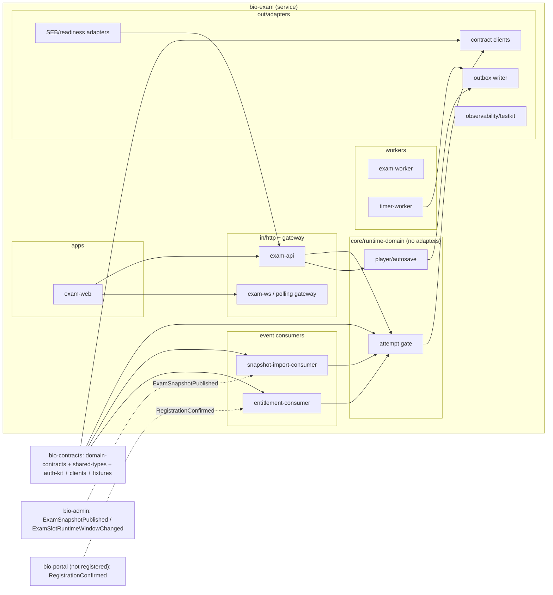
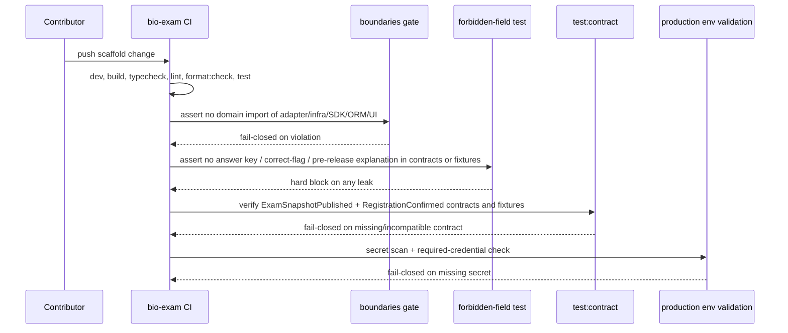

# ERD-003: Repo Scaffold: bio-exam

## 1. DB entity-relationship

No database schema is introduced by this scaffold. PRD-003 section 14 and SPEC-003 section 5 state no final attempt DB schema is defined; module boundaries only reserve homes for runtime domain, attempt gate, player/autosave, timer, submission, readiness, SEB, snapshot import, entitlement import, and observability/testkit. Attempt-state tables and their migrations belong to the owning downstream EXAM SPEC. No tables are invented here.

## 2. C4 Level-2: components

**Notes:** new components are every box inside `bio-exam`; `bio-contracts` is the dimmed dependency. `bio-admin` and `bio-portal` are upstream event producers (dotted; `bio-portal` not yet registered). `RegistrationConfirmed` enters via `entitlement-consumer` and becomes `ExamRegistration` to gate attempt start. Snapshots arrive key-stripped through `snapshot-import-consumer`. The `boundaries` gate keeps SEB/readiness adapters and contract clients outside `core/runtime-domain`.

## 3. Scaffold validation / build / contract flow (sequence)

## 4. Change summary

| Object | Change | Owner repo |
|--------|--------|------------|
| `exam-web` app shell (readiness/attempt/player/post-submit placeholders) | add | bio-exam |
| `exam-api`, `exam-ws`/polling gateway, `exam-worker`, `timer-worker` boundaries | add | bio-exam |
| `snapshot-import-consumer`, `entitlement-consumer` entrypoints | add | bio-exam |
| Module homes: runtime domain, contract clients, SEB/readiness adapters, observability/testkit | add | bio-exam |
| Script + gate set incl. `boundaries`, forbidden-field test, secret scan, prod env validation | add | bio-exam |
| Contract fixtures for consumed/emitted runtime events | add | bio-exam |
| `domain-contracts` / `shared-types` / `auth-kit` / contract clients consumption | use | bio-contracts |

## 5. Migration notes

- Forward: greenfield repo; no data migration. Downstream EXAM SPECs add attempt-state tables inside their mapped module home with their own migrations.
- Rollback: revert the scaffold package version or disable the inert baseline deployment if CI, startup, or forbidden-field checks fail. Fully reversible.
