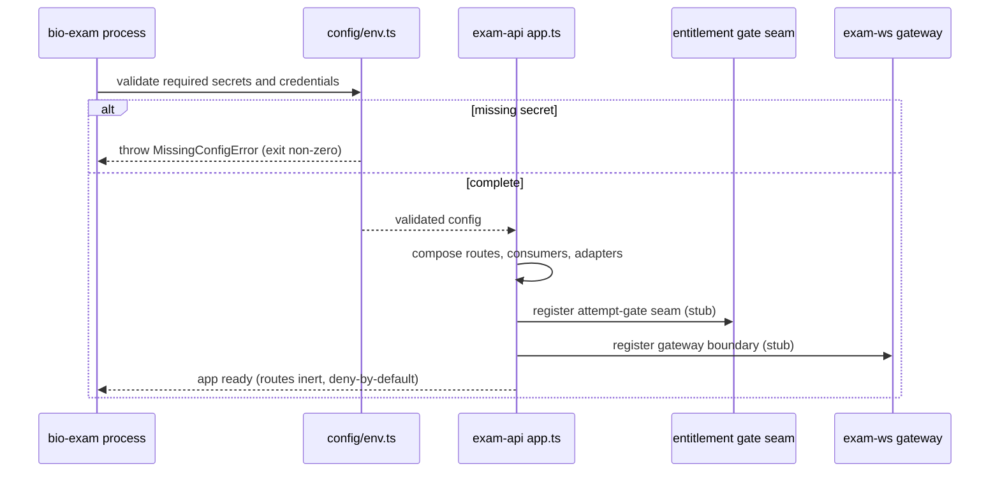
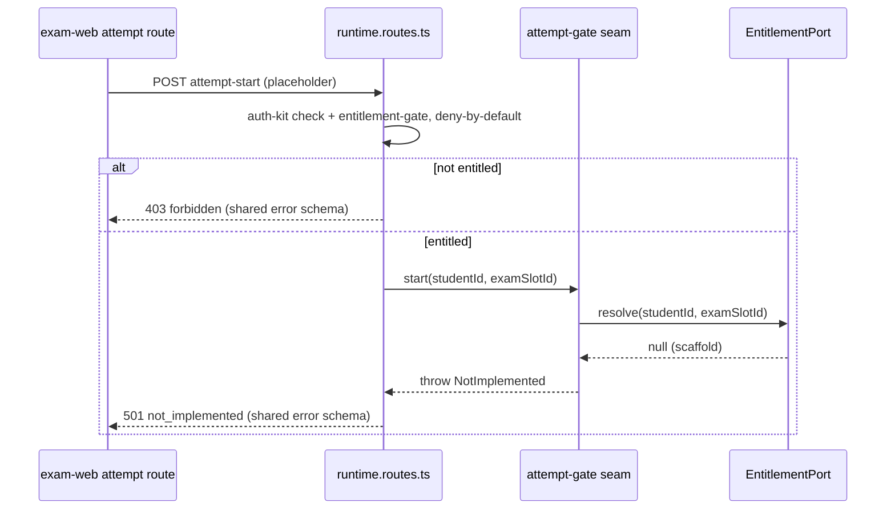
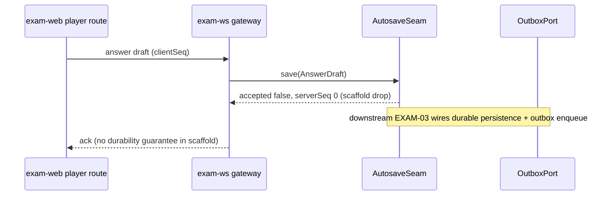
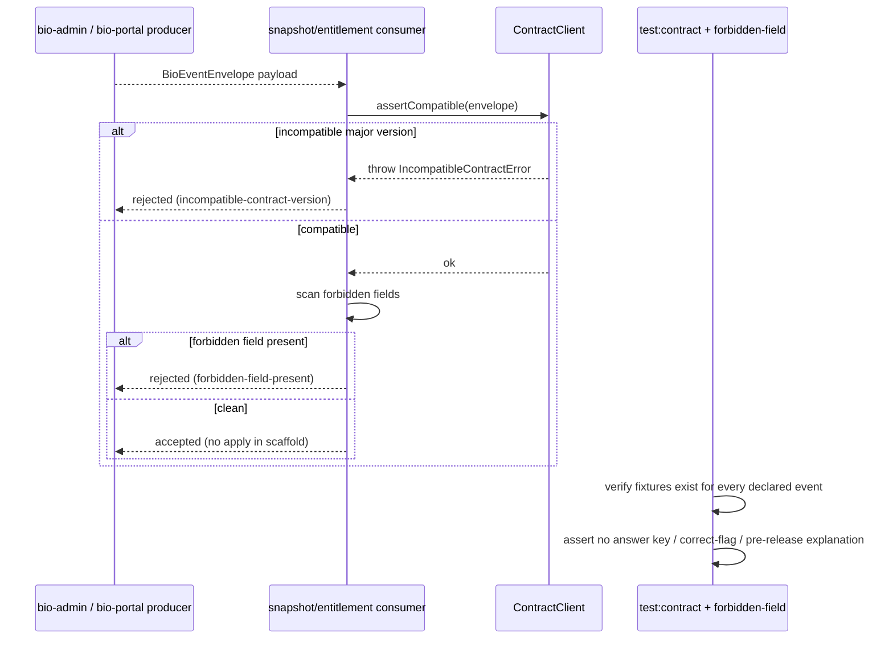

<!-- grill skipped: non-interactive run, grill is interactive-only. No grilled: block invented per task constraint. -->

# TDD-003: Repo Scaffold: bio-exam

## 1. Summary

Implements SPEC-003 and ERD-003: the inert `bio-exam` exam-window runtime baseline. Adds the `exam-web` app shell, runtime service/gateway/worker/consumer boundaries, hexagonal port seams for entitlement, readiness, timer, attempt, autosave, and outbox, contract clients and fixtures consumed from `bio-contracts`, plus the gate set (`boundaries`, `test:contract`, forbidden-field, secret-scan, prod env validation). No runtime behavior, no DB schema, no answer keys. `bio-contracts` is consumed only; nothing is authored there (SPEC-001 owns it).

## 2. File map per repo

Repo layout confirmed from `repos/bio-exam/`: pnpm workspace, Bun + Elysia for `services/exam-api`, Vite + React for `apps/exam-web`, Biome lint/format, ESLint boundaries gate scoped to `src/core/**`, Drizzle present but unused by this scaffold. Existing core seam: `services/exam-api/src/core/ports/{in,out}/`, `src/adapters/{in,out}/`, `src/infra/`, `src/app.ts`.

### Repo: bio-exam (service)

| Action | File | Purpose |
|--------|------|---------|
| Create | `services/exam-api/src/core/ports/in/runtime-entrypoints.port.ts` | Inbound port types for runtime routes, gateway, consumers, timer tick. Internals empty. |
| Create | `services/exam-api/src/core/ports/out/entitlement.port.ts` | `EntitlementPort` seam; resolves `ExamRegistration` from `RegistrationConfirmed`. No impl. |
| Create | `services/exam-api/src/core/ports/out/readiness.port.ts` | `ReadinessPort` and `SebAdapterPort` seams (device/identity, SEB). No impl. |
| Create | `services/exam-api/src/core/ports/out/snapshot-import.port.ts` | `SnapshotImportPort` seam for key-stripped `ExamSnapshotPublished`. |
| Create | `services/exam-api/src/core/ports/out/timer.port.ts` | `TimerPort` seam: durable-timer schedule/cancel reservation. No clock logic. |
| Create | `services/exam-api/src/core/ports/out/outbox.port.ts` | `OutboxPort` seam for attempt/answer/submission/integrity telemetry. |
| Create | `services/exam-api/src/core/domain/attempt/attempt-gate.ts` | Attempt-gate domain seam (entitlement check entry). Pure types + stub returning `not-implemented`. |
| Create | `services/exam-api/src/core/domain/attempt/attempt.types.ts` | `AttemptId`, `AttemptState` enum reservation. No DB binding. |
| Create | `services/exam-api/src/core/domain/player/autosave.seam.ts` | Autosave domain seam interface. No persistence. |
| Create | `services/exam-api/src/core/domain/timer/timer.seam.ts` | Timer domain seam interface. Server-authoritative reservation only. |
| Create | `services/exam-api/src/core/domain/index.ts` | Barrel for runtime-domain seams. |
| Create | `services/exam-api/src/adapters/in/http/runtime.routes.ts` | Placeholder runtime routes, entitlement-gated, deny-by-default, return `501 not_implemented`. |
| Create | `services/exam-api/src/adapters/in/ws/gateway.ts` | `exam-ws` / polling gateway boundary. Connection accept stub, no streaming. |
| Create | `services/exam-api/src/adapters/in/consumers/snapshot-import.consumer.ts` | `snapshot-import-consumer` entrypoint. Validates envelope, no apply. |
| Create | `services/exam-api/src/adapters/in/consumers/entitlement.consumer.ts` | `entitlement-consumer` entrypoint. Validates envelope, no apply. |
| Create | `services/exam-api/src/adapters/out/contracts/contract-client.ts` | Generated-style contract client wrapper over `@bio/domain-contracts`. Version gate. |
| Create | `services/exam-api/src/adapters/out/contracts/index.ts` | Barrel for contract clients. |
| Create | `services/exam-api/src/adapters/out/readiness/seb.adapter.ts` | SEB/readiness adapter stub. Stays outside `core/`. |
| Create | `services/exam-api/src/adapters/out/outbox/outbox.writer.ts` | Transactional outbox writer stub. No transport. |
| Create | `services/exam-api/src/adapters/out/observability/index.ts` | Observability/testkit wiring over `@bio/shared-types` envelopes. |
| Create | `services/exam-api/src/config/env.ts` | Fail-closed env validation. Missing required secret throws at startup. |
| Modify | `services/exam-api/src/app.ts` | Compose runtime routes, gateway, consumers, adapters into the Elysia app shell. |
| Create | `services/exam-worker/src/index.ts` | `exam-worker` boundary entrypoint. Health + empty loop. |
| Create | `services/timer-worker/src/index.ts` | `timer-worker` scheduled entrypoint. Tick stub, no countdown. |
| Create | `services/exam-worker/package.json` | Worker package, `dev`/`build`/`test`/`typecheck` scripts. |
| Create | `services/timer-worker/package.json` | Timer-worker package, same script set. |
| Create | `apps/exam-web/src/features/readiness/route.tsx` | Readiness route placeholder (default/empty/loading/error states). |
| Create | `apps/exam-web/src/features/attempt/route.tsx` | Attempt route placeholder. |
| Create | `apps/exam-web/src/features/player/route.tsx` | Player route placeholder. No answer-key surface. |
| Create | `apps/exam-web/src/features/post-submit/route.tsx` | Post-submit route placeholder. |
| Create | `apps/exam-web/src/shared/routes.ts` | Route map registering the four placeholders. |
| Modify | `apps/exam-web/src/App.tsx` | Mount the route map. |
| Create | `packages/contract-fixtures/src/exam-events.fixtures.ts` | Fixtures for every consumed/emitted event at the repo boundary. |
| Create | `packages/contract-fixtures/src/forbidden-field.test.ts` | Forbidden-field test over fixtures and student-facing contracts. |
| Create | `services/exam-api/test/runtime-routes.test.ts` | Asserts placeholders return `501` and are entitlement-gated. |
| Create | `services/exam-api/test/consumers.test.ts` | Asserts consumers validate envelope and reject incompatible contract version. |
| Create | `services/exam-api/test/env.test.ts` | Asserts startup fails closed on missing secret. |
| Create | `services/exam-api/test/contract-client.test.ts` | Asserts contract client rejects an incompatible major version. |
| Create | `services/exam-api/test/boundaries.fixture.ts` | Negative fixture: a core import of an adapter, used to prove the gate fails. |
| Modify | `services/exam-api/.eslintrc.json` | Extend `lint:boundaries` rules to ban adapter/infra/SDK/ORM/UI imports from `src/core/**`. |
| Modify | `package.json` | Add `exam-worker` and `timer-worker` to workspace `dev`/`build`/`test`/`typecheck` fan-out; confirm `test:contract` covers exam-event fixtures and the forbidden-field test. |
| Create | `.github/workflows/ci.yml` (or extend existing) | Run `build`, `typecheck`, `lint`, `format:check`, `test`, `test:contract`, `security:audit`, `boundaries`, secret scan, prod env validation as required checks. |
| Create | `docs/EXAM-PRD-OWNERSHIP.md` | Map EXAM-00..06 to owning app/service/worker/consumer/adapter/module home. |

### Repo: bio-contracts (shared-lib, consumed only)

No file is authored here. SPEC-001 owns it. The scaffold adds these as dependencies in `bio-exam` and imports the entry points below.

| Action | File | Purpose |
|--------|------|---------|
| Use | `packages/domain-contracts/src/index.ts:7-30` | `BioEventEnvelope<T>`, `CrossRepoEventType`, `CROSS_REPO_EVENT_TYPES`. Single source of cross-service shapes. |
| Use | `packages/shared-types/src/index.ts` | `CONTRACT_VERSION` (pinned `0.1.0`), log/trace envelope types. |
| Use | `packages/auth-kit/src` | `AuthClaims`, `AuthorizationPolicy`, `BioRole` for entitlement-gating placeholders. |
| Use | `packages/contract-fixtures/src` | Upstream fixture conventions mirrored by the `bio-exam` exam-event fixtures. |

## 3. Key interfaces

Interfaces are the contract for downstream EXAM PRDs. All bodies are stubs in the scaffold (return `not-implemented` or accept-and-drop). Signatures are the stable surface.

### 3.1 Runtime app shell (composition root)

```ts
// services/exam-api/src/core/ports/in/runtime-entrypoints.port.ts
import type { BioEventEnvelope, CrossRepoEventType } from "@bio/domain-contracts";

/** Inbound boundary surface. Downstream EXAM PRDs add concrete routes and handlers. */
export interface RuntimeHttpEntrypoint {
  /** Placeholder runtime route registration. Deny-by-default, entitlement-gated. */
  readonly path: string;
  readonly requiresEntitlement: true;
}

export interface RuntimeGatewayEntrypoint {
  /** exam-ws or polling gateway. Reconnect/backoff owned downstream. */
  accept(connectionId: string): Promise<void>;
}

export interface EventConsumerEntrypoint<T extends CrossRepoEventType> {
  readonly eventType: T;
  /** Validate envelope + contract version. No domain apply in scaffold. */
  consume(envelope: BioEventEnvelope<unknown>): Promise<ConsumeOutcome>;
}

export type ConsumeOutcome =
  | { readonly status: "accepted"; readonly checkpoint: string }
  | { readonly status: "rejected"; readonly reason: ConsumerRejectReason };

export type ConsumerRejectReason =
  | "incompatible-contract-version"
  | "unknown-event-type"
  | "forbidden-field-present";
```

### 3.2 Entitlement and readiness ports

```ts
// services/exam-api/src/core/ports/out/entitlement.port.ts
import type { BioEventEnvelope } from "@bio/domain-contracts";

/** RegistrationConfirmed -> ExamRegistration. Gates attempt start. */
export interface ExamRegistration {
  readonly registrationId: string;
  readonly studentId: string;
  readonly examSlotId: string;
  readonly entitled: boolean;
}

export interface EntitlementPort {
  /** Resolve a stored entitlement for an attempt-start check. Stub returns null. */
  resolve(studentId: string, examSlotId: string): Promise<ExamRegistration | null>;
  /** Project a RegistrationConfirmed envelope into ExamRegistration. */
  fromConfirmed(envelope: BioEventEnvelope<unknown>): ExamRegistration;
}
```

```ts
// services/exam-api/src/core/ports/out/readiness.port.ts
export type ReadinessStatus = "unknown" | "passed" | "failed";

export interface ReadinessPort {
  /** Device/identity readiness check seam. Stub returns "unknown". */
  check(studentId: string, attemptId: string): Promise<ReadinessStatus>;
}

/** SEB lockdown adapter seam. Implemented by an out-adapter, never by core. */
export interface SebAdapterPort {
  isLockdownActive(attemptId: string): Promise<boolean>;
}
```

### 3.3 Timer and attempt domain seams

```ts
// services/exam-api/src/core/ports/out/timer.port.ts
export type AttemptId = string & { readonly __brand: "AttemptId" };

export interface TimerReservation {
  readonly attemptId: AttemptId;
  readonly durationSeconds: number;
}

/** Server-authoritative durable-timer seam. No countdown logic in scaffold. */
export interface TimerPort {
  schedule(reservation: TimerReservation): Promise<void>;
  cancel(attemptId: AttemptId): Promise<void>;
}
```

```ts
// services/exam-api/src/core/domain/attempt/attempt-gate.ts
import type { AttemptId } from "../../ports/out/timer.port";
import type { EntitlementPort } from "../../ports/out/entitlement.port";

export type AttemptState = "not-started" | "in-progress" | "submitted" | "expired";

export interface AttemptStartResult {
  readonly attemptId: AttemptId;
  readonly state: AttemptState;
}

/** Attempt-start gate seam. Scaffold body throws NotImplemented. */
export interface AttemptGate {
  start(studentId: string, examSlotId: string, ports: { entitlement: EntitlementPort }): Promise<AttemptStartResult>;
}
```

### 3.4 Autosave and outbox seams

```ts
// services/exam-api/src/core/domain/player/autosave.seam.ts
import type { AttemptId } from "../../ports/out/timer.port";

export interface AnswerDraft {
  readonly attemptId: AttemptId;
  readonly questionId: string;
  readonly response: unknown;
  readonly clientSeq: number;
}

/** Autosave domain seam. Scaffold accepts and drops; downstream adds durability. */
export interface AutosaveSeam {
  save(draft: AnswerDraft): Promise<{ readonly accepted: boolean; readonly serverSeq: number }>;
}
```

```ts
// services/exam-api/src/core/ports/out/outbox.port.ts
export type RuntimeTelemetryKind =
  | "attempt"
  | "answer-save"
  | "submission"
  | "auto-submission"
  | "integrity";

export interface OutboxRecord {
  readonly kind: RuntimeTelemetryKind;
  readonly idempotencyKey: string;
  readonly payload: unknown;
}

/** Transactional outbox seam. Scaffold persists nothing and emits nothing. */
export interface OutboxPort {
  enqueue(record: OutboxRecord): Promise<void>;
}
```

### 3.5 Contract client and version gate

```ts
// services/exam-api/src/adapters/out/contracts/contract-client.ts
import { CONTRACT_VERSION } from "@bio/shared-types";
import type { BioEventEnvelope, CrossRepoEventType } from "@bio/domain-contracts";

export interface ContractClient {
  /** Reject when envelope major version differs from the pinned CONTRACT_VERSION. */
  assertCompatible(envelope: BioEventEnvelope<unknown>): void;
  readonly pinnedVersion: typeof CONTRACT_VERSION;
  readonly knownTypes: ReadonlyArray<CrossRepoEventType>;
}
```

## 4. Sequence diagrams

### 4.1 Bootstrap (fail-closed startup)



### 4.2 Attempt entitlement check (gated placeholder)



### 4.3 Answer autosave seam



### 4.4 Contract validation (consumer + CI)



## 5. Data shapes

Reference ERD-003. No DB tables. Key types consumers need:

- `BioEventEnvelope<T>` (`@bio/domain-contracts`): `eventId`, `eventType`, `eventVersion` (equals `CONTRACT_VERSION`), `occurredAt`, `producer`, `correlationId`, `idempotencyKey`, `payload`.
- `CrossRepoEventType` union includes `RegistrationConfirmed`, `RegistrationCancelled`, `ExamSnapshotPublished`, `ExamSlotPublished`, `attempt.submitted`, `ProctorSessionRequested`, `RiskScoreChanged`, `ProctorReportFinalized`.
- `ExamRegistration` (local projection of `RegistrationConfirmed`).
- `CONTRACT_VERSION` pinned `0.1.0`; the contract client rejects an incompatible major.
- Snapshot payloads stay key-stripped: no `correctAnswer`, correct-option flag, or pre-release `explanation` in any contract or fixture.

## 6. Failure handling matrix

| Failure | Layer | Surface | Retry? | Idempotency key |
|---------|-------|---------|--------|-----------------|
| Missing required secret at startup | `config/env.ts` | Process exit non-zero, `MissingConfigError` log | No | n/a |
| Answer key / correct-flag / pre-release explanation in contract or fixture | CI forbidden-field test | Hard CI block | No | n/a |
| Incompatible `ExamSnapshotPublished` contract version | `snapshot-import.consumer.ts` | Reject `incompatible-contract-version`, `test:contract` fail | No (manual contract bump) | `envelope.idempotencyKey` |
| Incompatible `RegistrationConfirmed` contract version | `entitlement.consumer.ts` | Reject `incompatible-contract-version` | No | `envelope.idempotencyKey` |
| Unknown event type at a consumer | consumers | Reject `unknown-event-type`, drop | No | `envelope.idempotencyKey` |
| Core imports adapter/infra/SDK/ORM/UI | `boundaries` gate (ESLint on `src/core/**`) | Merge block, violating import path reported | No | n/a |
| SEB/readiness adapter referenced inside `core/` | `boundaries` gate | Merge block | No | n/a |
| Attempt-start hit before downstream impl | `runtime.routes.ts` + attempt-gate | `501 not_implemented` (shared error schema) | No | n/a |
| Autosave received in scaffold | `autosave.seam.ts` | `accepted: false`, no durability | Client may retry; no server dedupe yet | `attemptId + questionId + clientSeq` (reserved) |
| Missing fixture for a declared event | `test:contract` | CI fail | No | n/a |
| Unauthenticated or unentitled runtime call | `runtime.routes.ts` | `403` deny-by-default (shared error schema) | No | n/a |

## 7. Test outline

- `services/exam-api/test/env.test.ts`
  - startup fails closed when a required secret is absent
  - startup succeeds with a complete config
- `services/exam-api/test/runtime-routes.test.ts`
  - placeholder route returns `501 not_implemented`
  - unentitled call returns `403` (deny-by-default)
  - error body matches the shared error schema (`code`, `message`, `correlationId`)
- `services/exam-api/test/consumers.test.ts`
  - compatible `ExamSnapshotPublished` envelope is accepted, no apply
  - incompatible major version rejected with `incompatible-contract-version`
  - unknown event type rejected with `unknown-event-type`
  - idempotent on a repeated `idempotencyKey` (no duplicate accept)
- `services/exam-api/test/contract-client.test.ts`
  - `assertCompatible` passes on pinned `0.1.0`
  - `assertCompatible` throws on a major bump
- `packages/contract-fixtures/src/forbidden-field.test.ts`
  - fixtures carry no `correctAnswer`, correct-option flag, or pre-release `explanation`
  - a planted forbidden field fails the test (negative case)
- `packages/contract-fixtures/src/exam-events.fixtures.ts` coverage check
  - every event in the declared consumed/emitted set has a fixture
- `services/exam-api/test/boundaries.fixture.ts` + `boundaries` gate
  - a core import of an adapter is reported and the gate fails (negative case)
- `apps/exam-web` route placeholders
  - each route renders default, empty, loading, and error states
  - no route surfaces answer-key fields

## 8. Observability additions

- Metrics: `ci_gate_status`, `boundary_violation_count`, `contract_test_failure_count`, `forbidden_field_failure_count`, `missing_secret_startup_failure_count`, `readiness_healthcheck_status`.
- Logs: structured startup, config-validation, and consumer-checkpoint logs using the `@bio/shared-types` log envelope. Reject reasons logged with `correlationId`.
- Traces: trace envelope wired from `@bio/shared-types`; runtime spans deferred to downstream EXAM features.
- Dashboards: CI gate, boundary, and forbidden-field view owned by PLAT-04; this scaffold emits the signals only.

## 9. Open questions

- Gateway transport (WebSocket vs polling) is left as a boundary choice for EXAM-03; the seam supports both. No decision needed for the scaffold.
- Worker process topology (separate `services/exam-worker` and `services/timer-worker` packages vs a single worker with two entrypoints) is set as two packages here to allow independent exam-window scaling per SPEC-003 section 10. Revisit if PLAT-03 infra prefers a single worker image.
