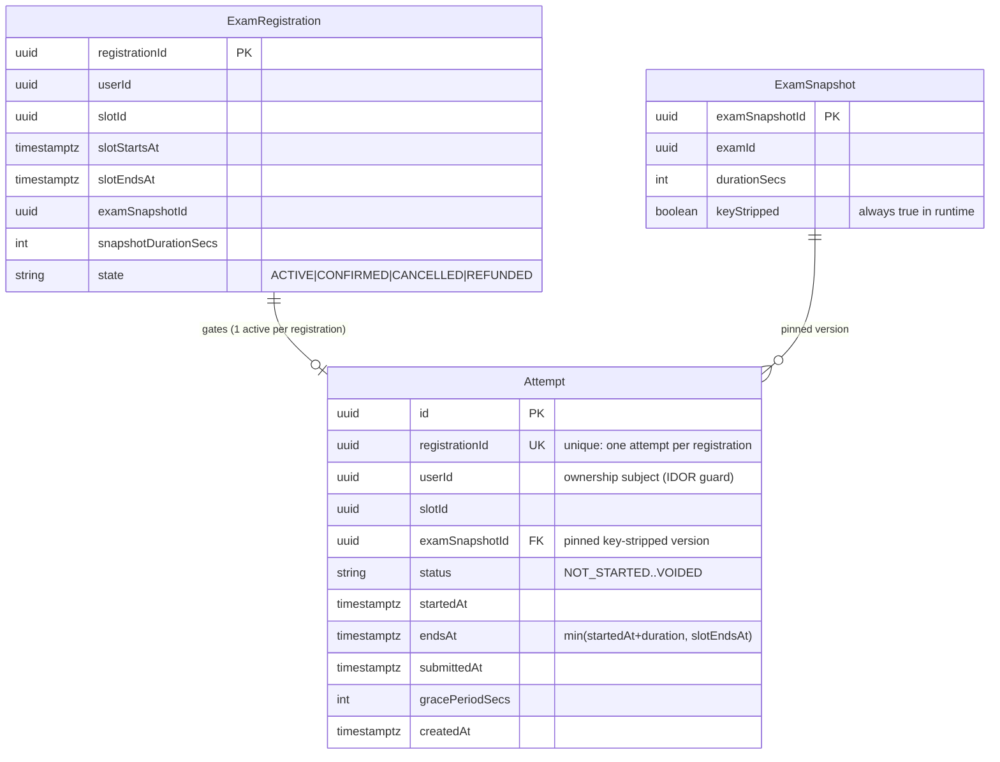
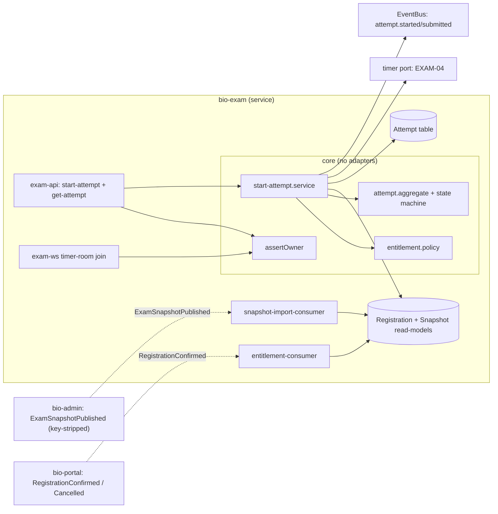
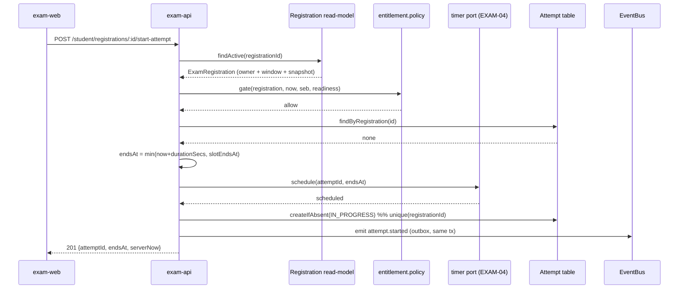

# ERD-004: Attempt Lifecycle & Entitlement Gate (Ownership on HTTP + WS)

## 1. DB entity-relationship

`bio-exam` owns `Attempt`. `ExamRegistration` and `ExamSnapshot` are local read-model projections
built by consumers from `RegistrationConfirmed` (PORTAL-07) and `ExamSnapshotPublished` (ADMIN-04). The
snapshot projection is key-stripped: no answer keys land in the runtime database.

**Notes:** the unique constraint on `Attempt.registrationId` is the idempotency key (FR-7): a
double-start resolves to the existing row. `userId` is the single ownership subject checked on every
HTTP route and the WS join. `examSnapshotId` pins the immutable published version so mid-window
re-publishes never change a live attempt.

## 2. C4 Level-2: components

The `boundaries` gate keeps `core` free of adapters: the policy, aggregate, ownership predicate, and
service import only ports, never Drizzle, Elysia, Redis, or the WS library.

## 3. Hot path: start-attempt (create)

If the timer cannot schedule, the service returns `503` and persists no attempt (fail closed, no
untimed exam).

## 4. Change summary

| Object | Change | Owner repo |
|--------|--------|------------|
| `Attempt` table + unique(`registrationId`) | add | bio-exam |
| `ExamRegistration` / `ExamSnapshot` read-model projections | add | bio-exam |
| entitlement.policy, attempt.aggregate, assertOwner, start-attempt.service | add | bio-exam |
| ownership guard on HTTP routes + WS join | add | bio-exam |
| entitlement-consumer / snapshot-import-consumer apply logic | modify | bio-exam |
| `attempt.started` / `attempt.submitted` emission | add | bio-exam |
| `RegistrationConfirmed`, `ExamSnapshotPublished`, runtime events | use | bio-contracts |
| key-stripped `ExamSnapshotPublished` producer | use | bio-admin |

## 5. Migration notes

- **Forward:** additive migration creating `Attempt` with the unique constraint on `registrationId`. No
  backfill. Against the shared Neon database the change is additive, so the legacy monolith engine keeps
  serving during cutover.
- **Rollback:** drop the `Attempt` table and constraint. No data loss because the capability is new and
  the flag (`exam02_attempt_gate`) gates traffic. Emitted events are idempotent, so replay after
  rollback does not double-apply.
