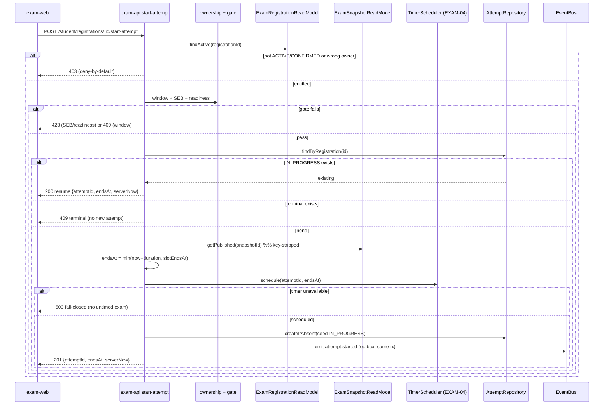
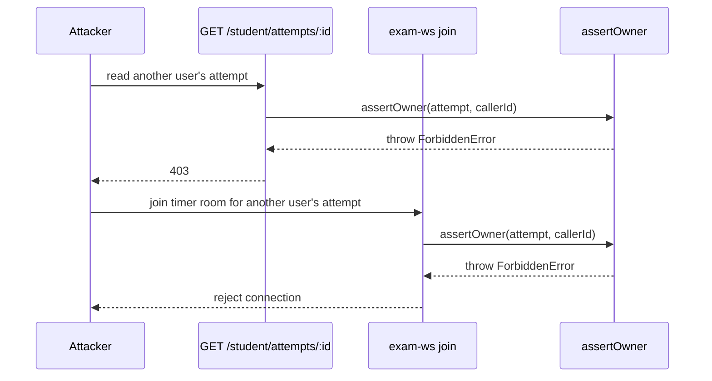

# TDD-004: Attempt Lifecycle & Entitlement Gate (Ownership on HTTP + WS)

## 1. Summary

Implements SPEC-004 and ERD-004 in `bio-exam`: the attempt aggregate and state machine, an idempotent
create-or-resume start keyed by `registrationId`, a deny-by-default entitlement gate (registration,
window, SEB, readiness), one ownership guard shared by every attempt HTTP route and the `exam-ws`
timer-room join, a durable `endsAt` scheduled through the EXAM-04 timer port (fail closed), and a
key-stripped snapshot pinned onto the attempt. Answer keys never enter the runtime. `bio-admin` and
`bio-contracts` are consumed only.

The seams already exist from SPEC-003. This TDD fills them: it turns the `attempt-gate` stub into the
real gate, adds the `Attempt` persistence adapter and Drizzle schema, and adds the ownership guard on
both inbound paths.

## 2. File map per repo

### Repo: bio-exam (service)

| Action | File | Purpose |
|--------|------|---------|
| Create | `services/exam-api/src/core/ports/in/start-attempt.port.ts` | `StartAttemptUseCase` + `AttemptView` IO types. |
| Create | `services/exam-api/src/core/ports/in/get-attempt.port.ts` | `GetAttemptUseCase` (owner-checked read). |
| Create | `services/exam-api/src/core/ports/out/attempt-repository.port.ts` | `AttemptRepository`: find-by-registration, find-by-id, create, transition. |
| Create | `services/exam-api/src/core/ports/out/exam-registration.read-model.ts` | `ExamRegistrationReadModel.findActive(registrationId)`. |
| Create | `services/exam-api/src/core/ports/out/exam-snapshot.read-model.ts` | `ExamSnapshotReadModel.getPublished(snapshotId)` (key-stripped). |
| Modify | `services/exam-api/src/core/ports/out/timer.port.ts` | Use the SPEC-003 `TimerPort.schedule` for the durable `endsAt`. |
| Create | `services/exam-api/src/core/domain/attempt/attempt.aggregate.ts` | `Attempt` aggregate + `AttemptStatus` state machine + guarded transitions. |
| Create | `services/exam-api/src/core/domain/attempt/entitlement.policy.ts` | Pure gate decision: registration ACTIVE, window, SEB required, readiness. |
| Modify | `services/exam-api/src/core/domain/attempt/attempt-gate.ts` | Replace the `not-implemented` stub with the `StartAttempt` service composing the policy + ports. |
| Create | `services/exam-api/src/core/services/start-attempt.service.ts` | Orchestrates gate, create/resume, `endsAt=min(...)`, timer schedule, `attempt.started` emit. |
| Create | `services/exam-api/src/core/services/attempt-ownership.ts` | Pure `assertOwner(attempt, callerId)` predicate shared by HTTP + WS. |
| Create | `services/exam-api/src/adapters/out/persistence/schema/attempt.ts` | Drizzle table `Attempt`, unique on `registrationId`. |
| Create | `services/exam-api/src/adapters/out/persistence/drizzle-attempt.repository.ts` | `AttemptRepository` impl (upsert-by-registration for idempotent create). |
| Create | `services/exam-api/src/adapters/out/persistence/drizzle-exam-registration.read-model.ts` | Reads the local `ExamRegistration` projection. |
| Create | `services/exam-api/src/adapters/out/persistence/drizzle-exam-snapshot.read-model.ts` | Reads key-stripped published snapshot. |
| Modify | `services/exam-api/src/adapters/in/http/runtime.routes.ts` | Real `POST /student/registrations/:registrationId/start-attempt` and `GET /student/attempts/:attemptId`, both guarded. |
| Create | `services/exam-api/src/adapters/in/http/ownership.guard.ts` | HTTP guard calling `attempt-ownership`; `403` on mismatch. |
| Modify | `services/exam-api/src/adapters/in/ws/gateway.ts` | Timer-room join runs the same `assertOwner` before admit; reject non-owner. |
| Modify | `services/exam-api/src/adapters/in/consumers/entitlement.consumer.ts` | Apply `RegistrationConfirmed`/`RegistrationCancelled` to the read-model. |
| Modify | `services/exam-api/drizzle/migrations/` | Additive forward migration for `Attempt`; reversible down migration. |
| Create | `services/exam-api/test/start-attempt.test.ts` | Gate, idempotency, resume, fail-closed. |
| Create | `services/exam-api/test/idor.test.ts` | Non-owner HTTP `403` and WS-join rejection (regression). |
| Create | `services/exam-api/test/attempt-state-machine.test.ts` | Legal/illegal transitions; terminal is absorbing. |

### Repo: bio-contracts (consumed only)

| Action | File | Purpose |
|--------|------|---------|
| Use | `packages/domain-contracts/src/events/runtime.ts` | `AttemptStartedPayload`, `AttemptSubmittedPayload` emitted here. |
| Use | `packages/domain-contracts/src/events/commerce.ts` | `RegistrationConfirmed`/`RegistrationCancelled` consumed. |
| Use | `packages/domain-contracts/src/events/admin.ts` | `ExamSnapshotPublished` consumed (key-stripped). |
| Use | `packages/auth-kit/src` | Session claims for the ownership guard. |

### Repo: bio-admin (consumed only)

Publishes `ExamSnapshotPublished` (ADMIN-04) key-stripped. No file authored here. Answer keys stay in
bio-admin; the runtime never receives them.

## 3. Key interfaces

Interfaces land before implementation (TDD-004 rule). Bodies follow in the service files above.

```ts
// core/ports/in/start-attempt.port.ts
export interface StartAttemptInput {
  readonly registrationId: string;
  readonly callerId: string;   // authenticated subject (auth-kit)
  readonly sebHeaders?: Readonly<Record<string, string>>;
}
export interface AttemptView {
  readonly attemptId: string;
  readonly status: AttemptStatus;
  readonly endsAt: string;     // ISO, server authority
  readonly serverNow: string;  // ISO
}
export interface StartAttemptUseCase {
  execute(input: StartAttemptInput): Promise<AttemptView>;
}
```

```ts
// core/domain/attempt/attempt.aggregate.ts
export type AttemptStatus =
  | "NOT_STARTED" | "IN_PROGRESS" | "SUBMITTING"
  | "SUBMITTED" | "AUTO_SUBMITTED" | "EXPIRED_WITH_ERROR" | "VOIDED";

export interface Attempt {
  readonly id: string;
  readonly registrationId: string;
  readonly userId: string;
  readonly slotId: string;
  readonly examSnapshotId: string;
  readonly status: AttemptStatus;
  readonly startedAt: Date | null;
  readonly endsAt: Date | null;
  readonly submittedAt: Date | null;
}
const TERMINAL: ReadonlySet<AttemptStatus> = new Set([
  "SUBMITTED", "AUTO_SUBMITTED", "EXPIRED_WITH_ERROR", "VOIDED",
]);
export function isTerminal(s: AttemptStatus): boolean { return TERMINAL.has(s); }
```

```ts
// core/ports/out/attempt-repository.port.ts
export interface AttemptRepository {
  findByRegistration(registrationId: string): Promise<Attempt | null>;
  findById(id: string): Promise<Attempt | null>;
  /** Idempotent create: unique(registrationId) makes a double-start return the existing row. */
  createIfAbsent(seed: NewAttempt): Promise<Attempt>;
  transition(id: string, to: AttemptStatus, at: Date): Promise<Attempt>;
}
```

```ts
// core/ports/out/exam-registration.read-model.ts
export interface ExamRegistration {
  readonly registrationId: string;
  readonly userId: string;
  readonly slotId: string;
  readonly slotStartsAt: Date;
  readonly slotEndsAt: Date;
  readonly examSnapshotId: string;
  readonly snapshotDurationSecs: number;
  readonly state: "ACTIVE" | "CONFIRMED" | "CANCELLED" | "REFUNDED";
}
export interface ExamRegistrationReadModel {
  findActive(registrationId: string): Promise<ExamRegistration | null>;
}
```

```ts
// core/services/attempt-ownership.ts  (shared by HTTP guard + WS join)
import { ForbiddenError } from "../errors";
export function assertOwner(attempt: { userId: string }, callerId: string): void {
  if (attempt.userId !== callerId) throw new ForbiddenError("IDOR");
}
```

## 4. Sequence diagrams

### 4.1 Start attempt (create, cross-service)



### 4.2 IDOR denial (HTTP read + WS join share one predicate)



## 5. Data shapes

Reference ERD-004. The `Attempt` table is owned here (unique `registrationId`). `ExamRegistration` and
`ExamSnapshot` are local read-model projections built by the consumers from `RegistrationConfirmed`
and `ExamSnapshotPublished`. All event shapes come from `@bio/domain-contracts`; the emitted
`attempt.started`/`attempt.submitted` use `BioEventEnvelope` with `producer: "bio-exam"`.

## 6. Failure handling matrix

| Failure | Layer | Surface | Retry? | Idempotency key |
|---------|-------|---------|--------|-----------------|
| Non-owner reads attempt (HTTP) | `ownership.guard.ts` | `403` | No | n/a |
| Non-owner joins timer room (WS) | `gateway.ts` + `assertOwner` | reject connection | No | n/a |
| No ACTIVE/CONFIRMED registration | `entitlement.policy` | `403` deny-by-default | No | n/a |
| Start outside slot window | `entitlement.policy` | `400` not-started / closed | No | n/a |
| SEB required and invalid | `SebAdapterPort` | `423` fail-closed | No | n/a |
| Timer schedule fails at start | `TimerScheduler` | `503`, no attempt persisted | Client retry | `attemptId` (reserved on retry) |
| Double-start burst | `createIfAbsent` unique(`registrationId`) | returns existing IN_PROGRESS | No | `registrationId` |
| Start after terminal | `AttemptRepository.findByRegistration` | `409`, returns terminal | No | `registrationId` |
| Illegal state transition | `attempt.aggregate` | throws; `409` | No | n/a |
| Answer key in a runtime contract/fixture | forbidden-field test | CI block | No | n/a |

## 7. Test outline

- `start-attempt.test.ts`: entitled create returns `201` + server `endsAt`; unentitled `403`; outside
  window `400`; SEB fail `423`; timer-down `503` and no row persisted; `endsAt = min(...)` honored.
- `idor.test.ts` (regression): non-owner `GET` returns `403`; non-owner WS join rejected; owner passes.
- `attempt-state-machine.test.ts`: `NOT_STARTED→IN_PROGRESS→SUBMITTING→SUBMITTED` legal; any
  transition out of a terminal throws; `VOIDED` reachable only by admin/proctor path.
- idempotency: two concurrent starts on one `registrationId` yield one `IN_PROGRESS` (unique-constraint
  path), double-start returns the same `attemptId`.
- resume: reconnect returns the same attempt with `endsAt` recomputed from server clock; leaving and
  rejoining the WS room does not reset the timer.

## 8. Observability additions

Metrics `unauthorized_start_total` (0), `idor_denied_total`, `duplicate_attempt_total` (0),
`start_attempt_latency_p95`, `resume_success_rate`. Audit log per start/resume/deny with reason and
`correlationId`, using the `@bio/shared-types` log envelope. India data residency.

## 9. Open questions

Inherited from PRD-030: mid-attempt revocation policy, grace-period threshold for `endsAt + grace`
write rejection, and whether WS is enabled at all (ownership mandatory when it is). Pin defaults or land
an ADR before ralph consumes this.
